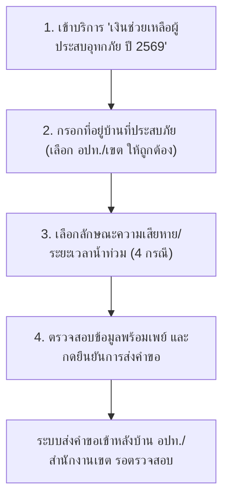

# 📱 คู่มือการใช้งานระบบ Mini-App "ลงทะเบียนเยียวยาผู้ประสบอุทกภัย 69" บนแอปทางรัฐ
> **สำหรับ:** ประชาชนและเจ้าหน้าที่ผู้ใช้งานระบบบริการดิจิทัล "เงินช่วยเหลือผู้ประสบอุทกภัย ปี 2569"  
> **โครงการ:** เงินช่วยเหลือผู้ประสบอุทกภัยในช่วงฤดูฝน ปี 2569 ตามมติคณะรัฐมนตรี (กรมป้องกันและบรรเทาสาธารณภัย - ปภ.)  
> **อัปเดตล่าสุด:** 5 ตุลาคม 2569 (เน้นขั้นตอนการกรอกข้อมูล, การเลือกพื้นที่ อปท./เขต, การติดตามสถานะ, และการแก้ไขปัญหาทางเทคนิค)

---

> [!IMPORTANT]
> ### 📌 ขอบเขตของระบบบริการลงทะเบียนเยียวยาอุทกภัยบนแอป "ทางรัฐ"
> - 📱 **ระบบนี้ใช้สำหรับ:** **ยื่นขอรับเงินช่วยเหลือเยียวยาผู้ประสบอุทกภัยตามมติ ครม. (ปภ.) สูงสุดไม่เกิน 9,000 บาท** ต่อครัวเรือน (ยื่นได้ทั่วประเทศ ทั้งใน กทม. และ ต่างจังหวัด)
> - 🏙️ **สำหรับประชาชนในพื้นที่กรุงเทพมหานคร:**
>   - เงินช่วยเหลือ ปภ. (มติ ครม. สูงสุด 9,000 บาท) ➔ ยื่นผ่านระบบ **"ลงทะเบียนเยียวยาอุทกภัย บนแอปทางรัฐ"**
>   - เงินชดเชยค่าซ่อมบ้านและค่าเสียหายจริงของ กทม. (สูงสุด 88,600 บาท) ➔ ยื่นผ่านเว็บไซต์ **"Claim Bangkok"**  
>   *(ประชาชนใน กทม. สามารถยื่นทั้งสองระบบควบคู่กันได้เพื่อรับสิทธิ์ทั้ง 2 ส่วน)*

---

## 📌 สารบัญหัวข้อด่วน (Quick Navigation)
1. [การเข้าสู่บริการและข้อกำหนดบัญชีรับเงิน](#1-การเข้าสู่บริการและข้อกำหนดบัญชีรับเงิน)
2. [ขั้นตอนการกรอกข้อมูลและยื่นคำขอใน Mini-App (Step-by-Step)](#2-ขั้นตอนการกรอกข้อมูลและยื่นคำขอใน-mini-app-step-by-step)
3. [เอกสารและภาพถ่ายประกอบการลงทะเบียน](#3-เอกสารและภาพถ่ายประกอบการลงทะเบียน)
4. [ความหมายของสถานะคำร้องและการติดตามผล](#4-ความหมายของสถานะคำร้องและการติดตามผล)
5. [รวมปัญหาทางเทคนิคที่พบบ่อยและวิธีแก้ไข (Troubleshooting & FAQs)](#5-รวมปัญหาทางเทคนิคที่พบบ่อยและวิธีแก้ไข-troubleshooting--faqs)
6. [ช่องทางการติดต่อสอบถามทางเทคนิค (Support Contacts)](#6-ช่องทางการติดต่อสอบถามทางเทคนิค-support-contacts)

---

## 1. การเข้าสู่บริการและข้อกำหนดบัญชีรับเงิน

### Q1: บริการลงทะเบียนเยียวยาผู้ประสบอุทกภัย อยู่ตรงไหนในแอปทางรัฐ?
**คำตอบ:** 
- เมื่อเปิดแอปพลิเคชันทางรัฐ จะพบแบนเนอร์เด่นที่หน้าแรก หรือเข้าไปที่ **หมวดบริการประชาชน ➔ เลือก "เงินช่วยเหลือผู้ประสบอุทกภัยในช่วงฤดูฝน ปี 2569"**
- กดเข้าสู่บริการเพื่อเริ่มต้นทำรายการยื่นคำขอ

### Q2: ข้อกำหนดบัญชีธนาคารสำหรับรับเงินโอนเยียวยา ต้องเป็นแบบใด?
**คำตอบ:**
- ต้องเป็นบัญชีธนาคารที่ **ผูกพร้อมเพย์ (PromptPay) ด้วยเลขประจำตัวประชาชน 13 หลักของผู้ยื่นคำขอเท่านั้น**
- ไม่สามารถใช้พร้อมเพย์ที่ผูกด้วยหมายเลขโทรศัพท์มือถือได้
- บัญชีต้องมีสถานะปกติ (ไม่ถูกอายัด, ไม่ปิดบัญชี, และชื่อ-นามสกุลต้องตรงกับผู้ยื่นคำขอ)

---

## 2. ขั้นตอนการกรอกข้อมูลและยื่นคำขอใน Mini-App (Step-by-Step)

### Q3: ขั้นตอนการกรอกข้อมูลในระบบลงทะเบียน มีลำดับอย่างไร?
**คำตอบ:** กระบวนการยื่นคำขอมี 4 ขั้นตอนหลัก ดังนี้:

1. **ระบุข้อมูลที่อยู่บ้านที่ประสบภัย:**
   - กรอกบ้านเลขที่, หมู่, ซอย, ถนน
   - ⚠️ **จุดสำคัญที่สุด (ห้ามเลือกผิด):** ต้องเลือก **จังหวัด, อำเภอ/เขต, และ องค์กรปกครองส่วนท้องถิ่น (เทศบาล/อบต./สำนักงานเขต)** ให้ตรงกับพื้นที่ที่ตั้งของบ้านที่ประสบภัยจริง เพื่อให้คำร้องถูกส่งไปยังเจ้าหน้าที่ผู้รับผิดชอบในพื้นที่โดยตรง
2. **กรณีบ้านไม่มีเลขที่บ้าน (ประเภทการครอบครอง):**
   - กรณีบ้านไม่มีเลขที่บ้าน ประเภทการครอบครอง ให้เลือกระบุ **บ้านตนเอง / บ้านเช่า** ให้ถูกต้อง *(บนหน้าแอปไม่มีให้ระบุสถานะของผู้ยื่นคำขอทั่วไป มีเพียงการระบุประเภทการครอบครองกรณีบ้านไม่มีเลขที่บ้าน)*
3. **เลือกลักษณะความเสียหาย/ระยะเวลาน้ำท่วม (ตามเกณฑ์ 4 กรณีของ ปภ.):**
   - กรณีที่ 1: ที่อยู่อาศัยประจำถูกน้ำท่วมขังไม่เกิน 7 วัน และทรัพย์สินเสียหาย
   - กรณีที่ 2: ที่อยู่อาศัยประจำถูกน้ำท่วมขังติดต่อกันเกินกว่า 7 วัน
   - กรณีที่ 3: ที่อยู่อาศัยประจำที่ถูกน้ำล้อมรอบ ติดต่อกันเกินกว่า 7 วันขึ้นไป
   - กรณีที่ 4: ที่อยู่อาศัยประจำในอาคารสูงที่น้ำท่วมขังไม่ถึงชั้นที่ผู้ประสบภัยอาศัย ติดต่อกันเกินกว่า 7 วันขึ้นไป
4. **ตรวจสอบข้อมูลและยืนยัน:** ตรวจสอบความถูกต้องของที่อยู่และข้อมูลพร้อมเพย์ จากนั้นกดปุ่มยืนยันส่งคำร้อง

---

## 3. เอกสารและภาพถ่ายประกอบการลงทะเบียน

### Q4: ในการยื่นผ่าน Mini-App ต้องแนบภาพถ่ายความเสียหายหรืออัปโหลดไฟล์เอกสารหรือไม่?
**คำตอบ:**
- **ไม่ต้องแนบภาพถ่ายความเสียหาย:** ระบบลงทะเบียนบนแอปทางรัฐในปัจจุบัน **ไม่ได้บังคับให้แนบภาพถ่ายความเสียหาย** และยังไม่มีช่องให้อัปโหลดไฟล์รูปภาพ ประชาชนสามารถกรอกข้อมูลตามความเป็นจริงและกดยื่นคำขอได้ทันที
- **การตรวจสอบข้อมูล:** ระบบจะตรวจสอบข้อมูลตัวบุคคลและสถานะทางทะเบียนราษฎรผ่านฐานข้อมูลภาครัฐโดยอัตโนมัติ
- **กรณีบ้านเช่า:** สำหรับกรณีบ้านไม่มีเลขที่บ้าน ให้เลือกระบุประเภทการครอบครองเป็น "บ้านเช่า" ทั้งนี้ อปท. หรือ สำนักงานเขต อาจขอตรวจสอบสัญญาเช่าหรือหนังสือรับรองการอยู่อาศัยในขั้นตอนลงพื้นที่หรือประสานงานเพิ่มเติมในภายหลัง

---

## 4. ความหมายของสถานะคำร้องและการติดตามผล

### Q5: แถบสถานะแต่ละแบบในระบบ มีความหมายอย่างไร?
**คำตอบ:**

| แถบสถานะ | ความหมาย | สิ่งที่ประชาชนต้องทำ |
| :--- | :--- | :--- |
| 🟡 **รอตรวจสอบข้อมูล** | คำร้องถูกส่งเข้าสู่ระบบหลังบ้านของ อปท. หรือ สำนักงานเขต เรียบร้อยแล้ว กำลังรอเจ้าหน้าที่ตรวจสอบความถูกต้อง | รอเจ้าหน้าที่ดำเนินการ ไม่ต้องกดยื่นคำขอซ้ำ |
| 🟣 **ส่งคืนเพื่อแก้ไข** *(ตัวหนังสือสีม่วง)* | เจ้าหน้าที่ตรวจสอบพบข้อผิดพลาด เช่น **เลือก อปท./สำนักงานเขต ผิดพื้นที่** หรือข้อมูลไม่ครบถ้วน | **กดเข้าไปในระบบเพื่อแก้ไขข้อมูล** เช่น กดเลือก อปท./เขต ให้ถูกต้อง แล้วกดยืนยันส่งใหม่ |
| 🟢 **ผ่านการตรวจสอบ / อยู่ระหว่างเสนอคณะกรรมการ** | คำร้องผ่านการคัดกรองเบื้องต้นจาก อปท./เขต และถูกรวบรวมเข้าสู่ที่ประชุมคณะกรรมการ ท.1 เรียบร้อยแล้ว | รอการส่งต่อให้อำเภอ/กทม. และ ปภ. สั่งจ่ายเงิน |
| 🔵 **ส่งข้อมูลให้ธนาคารโอนเงิน** | ปภ. อนุมัติการจ่ายเงินและส่งไฟล์ข้อมูลให้ธนาคารออมสินเพื่อโอนเข้าบัญชีพร้อมเพย์ | รอรับเงินโอนเข้าบัญชีพร้อมเพย์เลขบัตร ปชช. |
| 🔴 **ไม่อนุมัติ / มีผู้ลงทะเบียนแล้ว** | ตรวจพบว่าบ้านเลขที่ดังกล่าวมีการยื่นคำขอซ้ำซ้อน หรือไม่อยู่ในพื้นที่ประกาศเขตภัยพิบัติ | ตรวจสอบกับสมาชิกในบ้าน หรือติดต่อ อปท./เขต เพื่อยื่นอุทธรณ์ |

### Q6: ทำไมกดส่งแก้ไขข้อมูลไปแล้ว แต่สถานะยังขึ้นว่า "รอผู้ยื่นแก้ไขข้อมูล" อยู่?
**คำตอบ:**
- เนื่องจากมีผู้ลงทะเบียนใช้งานพร้อมกันจำนวนมากทั่วประเทศ การรับส่งข้อมูลระหว่างระบบแอปพลิเคชันและระบบหลังบ้านของเจ้าหน้าที่ อปท. จะทำการ **ประมวลผลเป็นรอบ (Batch Processing)**
- เมื่อผู้ยื่นกดส่งข้อมูลแก้ไขแล้ว ข้อมูลอาจใช้เวลาเดินทางเข้าสู่ระบบหลังบ้านประมาณ 1-2 ชั่วโมง ขอให้รอการประมวลผลตามลำดับคิวโดยไม่ต้องกดส่งย้ำซ้ำๆ

---

## 5. รวมปัญหาทางเทคนิคที่พบบ่อยและวิธีแก้ไข (Troubleshooting & FAQs)

### Q7: เลือก อปท. หรือ สำนักงานเขตผิด ทำให้คำร้องไปตกที่อื่น ประชาชนจะกดยกเลิกหรือย้ายเองได้ไหม?
**คำตอบ:**
- **ประชาชนไม่สามารถกดย้ายหรือยกเลิกคำร้องด้วยตนเองได้ในขณะที่สถานะขึ้น "รอตรวจสอบ"**
- **ขั้นตอนการแก้ไข:**
  1. เจ้าหน้าที่ของ อปท./เขต ที่ได้รับคำร้องผิดไป จะทำการกดปุ่ม **"ส่งคืนเพื่อแก้ไข"** ในระบบหลังบ้าน
  2. เมื่อส่งคืนแล้ว คำร้องในระบบจะเปลี่ยนเป็นสถานะสีม่วง **"ส่งคืนเพื่อแก้ไข"** พร้อมมีข้อความแจ้งเตือน
  3. ให้ผู้ยื่นเปิดระบบ เข้าไปที่คำร้องเดิม ➔ **กดเลือกจังหวัด อำเภอ และ อปท./สำนักงานเขต ที่ถูกต้อง** ➔ กดยืนยันส่งใหม่อีกครั้ง
  4. คำร้องจะย้ายไปยัง อปท./สำนักงานเขต ที่ถูกต้องทันทีโดยไม่ต้องเริ่มกรอกใหม่ทั้งหมด

### Q8: ระบบขึ้นว่า "ไม่อยู่ในเขตให้การช่วยเหลือ" ทั้งที่จังหวัดประกาศเขตภัยพิบัติแล้ว เกิดจากอะไร?
**คำตอบ:** เกิดขึ้นได้จาก 2 สาเหตุ:
1. **เลือก อปท./เขตผิด:** ตรวจสอบว่าตำบล/อปท. ที่เลือก เป็นพื้นที่ที่ถูกประกาศเป็นเขตภัยพิบัติตามราชกิจจานุเบกษา/ประกาศจังหวัดหรือไม่ โดยสามารถตรวจสอบรายชื่อตำบล/อปท. ที่ประกาศเป็นเขตให้ความช่วยเหลือฯ ได้จาก 👉 [ระบบตรวจสอบพื้นที่ประกาศเขตภัยพิบัติ ปภ. (relief.disaster.go.th)](https://relief.disaster.go.th/01a0477d-1fdf-778c-bd26-4aeac3e736cb)
2. **ระบบอยู่ระหว่างการซิงก์รหัสพื้นที่:** กรณีที่ประกาศภัยพิบัติเพิ่งได้รับการอนุมัติ ปภ. จะส่งรหัสพื้นที่เข้าสู่ฐานข้อมูลระบบลงทะเบียนเป็นรอบๆ หากเพิ่งประกาศวันแรก ขอให้เว้นระยะ 12-24 ชั่วโมงแล้วลองเข้าทำรายการใหม่อีกครั้ง หรือติดต่อ อปท. ในพื้นที่เพื่อตรวจสอบว่าระบบเปิดรับพื้นที่ดังกล่าวแล้วหรือยัง

### Q9: ระบบฟ้องว่า "เลขบัตรประชาชนนี้ใช้ไปแล้ว" หรือ "มีผู้ลงทะเบียนแล้วในบ้านหลังนี้" ทำอย่างไร?
**คำตอบ:**
- **เกณฑ์กฎหมาย:** เงินช่วยเหลือผู้ประสบภัย 1 หลังคาเรือน (1 เลขรหัสประจำบ้าน) ได้รับสิทธิ์เพียง **1 สิทธิ์เท่านั้น**
- **วิธีตรวจสอบและแก้ไข:**
  - ตรวจสอบกับสมาชิกในทะเบียนบ้านว่า มีบุคคลในครอบครัวหรือผู้เช่าคนอื่นยื่นคำขอไปก่อนแล้วหรือไม่ โดยในหน้ารายละเอียดของระบบจะแสดงข้อมูลเบื้องต้นว่าคำร้องถูกยื่นซ้ำกับผู้ใด
  - **หากต้องการเปลี่ยนให้เจ้าบ้านหรือผู้มีสิทธิ์ตัวจริงเป็นผู้รับเงิน:**
    1. ให้คนในครอบครัวตกลงกันว่าใครจะเป็นตัวแทนรับเงิน
    2. ติดต่อ อปท. หรือ ฝ่ายพัฒนาชุมชนฯ สำนักงานเขต เพื่อให้เจ้าหน้าที่ทำการ **"ปฏิเสธ"** รายการของคนที่ยื่นซ้ำก่อนหน้า
    3. **ผู้มีสิทธิ์ตัวจริงไม่ต้องกดยื่นใหม่ในแอป:** เมื่อเจ้าหน้าที่กดปฏิเสธรายการซ้ำก่อนหน้าแล้ว ระบบจะดึงคำร้องของผู้มีสิทธิ์ตัวจริงกลับเข้าสู่กล่องรายการคำร้องรอดำเนินการให้อัตโนมัติ
  - หากเป็นกรณีบ้านเลขที่เดียวกันแต่อาศัยอยู่คนละครอบครัวอย่างชัดเจน (เช่น บ้านแบ่งเช่าหลายห้อง) ให้เดินทางไปติดต่อสำนักงานเขต หรือ อปท. เพื่อให้เจ้าหน้าที่จัดทำเอกสารรับรองข้อเท็จจริงรายบุคคล

### Q10: ยื่นคำขอผ่านระบบสำเร็จแล้ว จำเป็นต้องเดินทางไปยื่นเอกสารที่ อปท. หรือ สำนักงานเขต อีกหรือไม่?
**คำตอบ:**
- **ไม่ต้องเดินทางไปยื่นซ้ำ:** ข้อมูลที่ส่งผ่านระบบจะเข้าสู่หน้าจอตรวจสอบของเจ้าหน้าที่ในพื้นที่โดยตรง
- **ข้อยกเว้น:** ไปติดต่อเฉพาะเมื่อได้รับการประสานจาก อปท./เขต ขอเอกสารยืนยันเพิ่มเติมเท่านั้น (เช่น สัญญาเช่าบ้าน หรือเอกสารยืนยันกรณีบ้านไม่มีเลขที่)
- **ข้อควรระวัง:** การเดินทางไป Walk-in ซ้ำอีกรอบโดยไม่ได้แจ้งเจ้าหน้าที่ อาจทำให้เกิดรายการซ้ำซ้อนในระบบ และทำให้กระบวนการตรวจสอบล่าช้าลง

### Q11: ยื่นคำขอแล้ว แต่ต่อมาโทรศัพท์เสีย หรือเข้าแอปไม่ได้ จะแก้ไขข้อมูลอย่างไร?
**คำตอบ:**
- ข้อมูลการลงทะเบียนผูกติดกับ **เลขประจำตัวประชาชนและบัญชีผู้ใช้งาน** ไม่ได้ผูกติดกับตัวเครื่องโทรศัพท์
- สามารถนำโทรศัพท์เครื่องอื่น (ของคนในครอบครัว) เข้าสู่ระบบด้วยบัญชีเดิมเพื่อเข้าไปดูสถานะหรือแก้ไขคำร้องได้
- หากไม่สะดวกใช้โทรศัพท์เครื่องอื่น สามารถนำบัตรประชาชนเดินทางไปติดต่อฝ่ายพัฒนาชุมชนฯ สำนักงานเขต (ใน กทม.) หรือ อปท. ในพื้นที่ เพื่อให้เจ้าหน้าที่ตรวจสอบสถานะคำร้องในระบบหลังบ้านให้

### Q12: กรณีผู้สูงอายุ ไม่มีสมาร์ตโฟน หรือใช้ระบบไม่เป็น มีแนวทางดำเนินการอย่างไร?
**คำตอบ:** ดำเนินการได้ 2 แนวทาง:
1. **ให้บุตรหลานช่วยลงทะเบียนผ่านระบบ:** โดยเข้าสู่ระบบและกรอกข้อมูลในนามของผู้สูงอายุ (เจ้าบ้าน/ผู้ประสบภัย)
2. **เดินทางไป Walk-in:** ไปที่จุดบริการ One-Stop Service ณ สำนักงานเขต (กทม. ทั้ง 50 เขต) หรือ ที่ว่าการอำเภอ / เทศบาล / อบต. โดยนำบัตรประชาชนและสมุดบัญชีธนาคารพร้อมเพย์ไปด้วย เจ้าหน้าที่มีทีมงานคอยบันทึกข้อมูลเข้าระบบให้โดยตรง

### Q13: ยื่นคำขอผ่านแอปทางรัฐไปแล้ว แต่เปลี่ยนใจไปยื่น Walk-in ที่ อปท./สำนักงานเขต จะมีปัญหาข้อมูลตีกันหรือไม่?
**คำตอบ:**
- **ไม่มีปัญหาครับ:** เมื่อประชาชนนำเอกสารหลักฐานไปยื่น Walk-in และเจ้าหน้าที่ อปท./สำนักงานเขต ตรวจสอบความถูกต้องพร้อมบันทึกเข้าระบบ Walk-in สำเร็จแล้ว ระบบจะยึดข้อมูลการ Walk-in เข้าสู่ที่ประชุม ท.1
- **สิ่งที่ต้องทำในแอปทางรัฐ:** ประชาชน **ไม่ต้องเข้าไปกดยื่นซ้ำหรือแก้ไขข้อมูลในแอปทางรัฐอีก** แม้สถานะเดิมในแอปจะขึ้นว่าส่งคืนข้อมูลสีม่วง ข้อมูลในแอปจะไม่ไปรบกวนสิทธิ์ที่เจ้าหน้าที่ได้อนุมัติผ่านระบบ Walk-in เรียบร้อยแล้ว

---

## 6. ช่องทางการติดต่อสอบถามทางเทคนิค (Support Contacts)

- 🚨 **สายด่วนนิรภัย กรมป้องกันและบรรเทาสาธารณภัย (ปภ.):** โทร. **1784** (ตลอด 24 ชั่วโมง)  
  *สอบถามหลักเกณฑ์สิทธิ์เงินช่วยเหลือตามมติ ครม. การตรวจสอบสถานะคำร้อง และการโอนเงิน*
- 📱 **DGA Contact Center (ผู้พัฒนาระบบลงทะเบียน):** โทร. **02-612-6060** (วันและเวลาราชการ)  
  *สอบถามปัญหาทางเทคนิคและข้อขัดข้องในการใช้งานระบบ*
- 🏛️ **ศูนย์บริการข้อมูลกรุงเทพมหานคร (กทม.):** โทร. **1555** (ตลอด 24 ชั่วโมง)  
  *สอบถามจุดบริการ Walk-in ฝ่ายพัฒนาชุมชนฯ 50 สำนักงานเขต และระบบ Claim Bangkok*
- 🌐 **ระบบตรวจสอบพื้นที่ประกาศเขตภัยพิบัติ ปภ.:** [https://relief.disaster.go.th/01a0477d-1fdf-778c-bd26-4aeac3e736cb](https://relief.disaster.go.th/01a0477d-1fdf-778c-bd26-4aeac3e736cb)  
  *สำหรับตรวจสอบรายชื่อจังหวัด อำเภอ ตำบล/อปท. ที่ประกาศเป็นเขตให้ความช่วยเหลือฯ ตามกฎหมาย*

---

*รวบรวมและปรับปรุงข้อมูลโดย Open Semantic Knowledge (OSK System) เพื่อเป็นคู่มือทางเทคนิคสำหรับประชาชนและเจ้าหน้าที่ผู้ปฏิบัติงาน*
