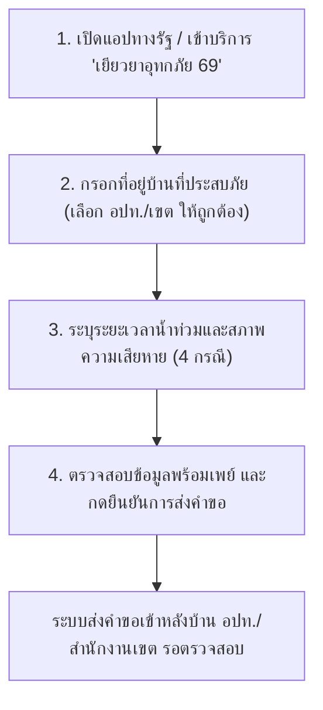

# 📱 รวมคำถาม-คำตอบ และคู่มือการใช้งาน Mini-App บนแอป "ทางรัฐ" (TangRat Mini-App Guide & Troubleshooting)
> **สำหรับ:** ประชาชนและเจ้าหน้าที่ผู้ใช้งานระบบยื่นคำขอรับเงินช่วยเหลือเยียวยาอุทกภัย ผ่านแอปพลิเคชัน "ทางรัฐ"  
> **โครงการ:** เงินช่วยเหลือผู้ประสบอุทกภัยในช่วงฤดูฝน ปี 2569 ตามมติคณะรัฐมนตรี (กรมป้องกันและบรรเทาสาธารณภัย - ปภ.)  
> **อัปเดตล่าสุด:** 5 ตุลาคม 2569 (ครอบคลุมขั้นตอนยื่นคำขอ, การตรวจสอบสถานะ, และวิธีแก้ไขข้อผิดพลาดทางเทคนิค)

---

> [!IMPORTANT]
> ### 📌 ขอบเขตของระบบ Mini-App บนแอป "ทางรัฐ"
> - 📱 **แอป "ทางรัฐ" ใช้สำหรับยื่นขอรับ:** **เงินช่วยเหลือผู้ประสบอุทกภัยตามมติ ครม. (ปภ.) สูงสุดไม่เกิน 9,000 บาท** ต่อครัวเรือน (ยื่นได้ทั่วประเทศ ทั้ง กทม. และ ต่างจังหวัด)
> - 🏙️ **สำหรับผู้ประสบภัยในพื้นที่กรุงเทพมหานคร:**
>   - เงินช่วยเหลือ ปภ. (มติ ครม. สูงสุด 9,000 บาท) ➔ ยื่นผ่านแอป **"ทางรัฐ"**
>   - เงินชดเชยค่าซ่อมบ้านและค่าเสียหายจริงของ กทม. (สูงสุด 88,600 บาท) ➔ ยื่นผ่านเว็บไซต์ **"Claim Bangkok"**  
>   *(ทั้งสองระบบทำงานแยกจากกัน ประชาชนใน กทม. สามารถยื่นคำขอได้ทั้ง 2 ระบบเพื่อรับทั้ง 2 สิทธิ์)*

---

## 📌 สารบัญหัวข้อด่วน (Quick Navigation)
1. [การเตรียมความพร้อมและการยืนยันตัวตน (Prerequisites & KYC)](#1-การเตรียมความพร้อมและการยืนยันตัวตน-prerequisites--kyc)
2. [ขั้นตอนการยื่นคำขอผ่าน Mini-App บนแอปทางรัฐ (Step-by-Step Guide)](#2-ขั้นตอนการยื่นคำขอผ่าน-mini-app-บนแอปทางรัฐ-step-by-step-guide)
3. [เอกสารและภาพถ่ายประกอบการยื่นคำขอ (Document & Photo Guidelines)](#3-เอกสารและภาพถ่ายประกอบการยื่นคำขอ-document--photo-guidelines)
4. [ความหมายของสถานะคำร้องและการติดตามผล (Status Tracking)](#4-ความหมายของสถานะคำร้องและการติดตามผล-status-tracking)
5. [รวมปัญหาทางเทคนิคที่พบบ่อยและวิธีแก้ไข (Troubleshooting & FAQs)](#5-รวมปัญหาทางเทคนิคที่พบบ่อยและวิธีแก้ไข-troubleshooting--faqs)
6. [ช่องทางการติดต่อและขอความช่วยเหลือทางเทคนิค (Support & Contacts)](#6-ช่องทางการติดต่อและขอความช่วยเหลือทางเทคนิค-support--contacts)

---

## 1. การเตรียมความพร้อมและการยืนยันตัวตน (Prerequisites & KYC)

### Q1: สามารถดาวน์โหลดแอปพลิเคชัน "ทางรัฐ" ได้จากช่องทางใดบ้าง?
**คำตอบ:** สามารถดาวน์โหลดได้ฟรีทั้งระบบปฏิบัติการ iOS และ Android:
- **iOS:** ดาวน์โหลดผ่าน App Store (ค้นหาคำว่า "ทางรัฐ")
- **Android:** ดาวน์โหลดผ่าน Google Play Store (ค้นหาคำว่า "ทางรัฐ")
- ติดตั้งและเปิดใช้งานเพื่อเข้าสู่กระบวนการลงทะเบียนบัญชีผู้ใช้งาน

### Q2: ต้องยืนยันตัวตน (KYC) อย่างไรก่อนเข้าใช้งานบริการเยียวยาอุทกภัย?
**คำตอบ:** ประชาชนสามารถยืนยันตัวตนเพื่อเข้าใช้งานแอปทางรัฐได้หลายวิธีตามความสะดวก:
1. **ยืนยันผ่านแอปพลิเคชัน ThaID (แนะนำ - รวดเร็วที่สุด):** หากมีแอป ThaID ของกรมการปกครองอยู่แล้ว สามารถกดยืนยันตัวตนผ่าน ThaID ได้ทันทีโดยไม่ต้องไปยืนยันที่ตู้
2. **สแกนบัตรประชาชนและสแกนใบหน้าผ่านแอปทางรัฐ:** ทำตามคำแนะนำบนหน้าจอ ถ่ายภาพบัตรประชาชนและสแกนใบหน้าเพื่อตรวจสอบอัตลักษณ์
3. **ยืนยันตัวตนผ่านช่องทางออฟไลน์:** เช่น เคาน์เตอร์เซอร์วิส (7-Eleven), ตู้บุญเติม, ตู้ ATM ธนาคารที่รองรับ หรือที่ทำการไปรษณีย์ไทย

### Q3: ต้องเตรียมบัญชีธนาคารสำหรับรับเงินอย่างไร?
**คำตอบ:**
- บัญชีธนาคารต้อง **ผูกพร้อมเพย์ (PromptPay) ด้วยเลขประจำตัวประชาชน 13 หลัก** เท่านั้น
- ไม่สามารถรับเงินผ่านพร้อมเพย์ที่ผูกด้วยเบอร์โทรศัพท์มือถือได้
- บัญชีต้องมีสถานะปกติ (ไม่ถูกระงับ, ไม่ปิดบัญชี, และชื่อ-นามสกุลต้องตรงกับผู้ยื่นคำขอ)

---

## 2. ขั้นตอนการยื่นคำขอผ่าน Mini-App บนแอปทางรัฐ (Step-by-Step Guide)

### Q4: ขั้นตอนการเข้าสู่บริการและกรอกข้อมูลในแอปทางรัฐ มีขั้นตอนอย่างไร?
**คำตอบ:** มีขั้นตอนหลัก 4 ขั้นตอน ดังนี้:

1. **เข้าสู่บริการ:** เข้าแอปพลิเคชันทางรัฐ ➔ ไปที่หมวดบริการประชาชน หรือแบนเนอร์ **"เงินช่วยเหลือผู้ประสบอุทกภัย ปี 2569"**
2. **ระบุข้อมูลที่อยู่บ้านที่ประสบภัย:**
   - กรอกบ้านเลขที่, หมู่, ซอย, ถนน
   - **จุดสำคัญที่สุด:** ต้องเลือก **จังหวัด, อำเภอ/เขต, และ องค์กรปกครองส่วนท้องถิ่น (เทศบาล/อบต./สำนักงานเขต)** ให้ตรงกับสถานที่ตั้งจริงของบ้านที่ประสบภัย
3. **เลือกลักษณะความเสียหาย/ระยะเวลาน้ำท่วม:** เลือกระดับความเดือดร้อนตามสภาพจริง (ตามเกณฑ์ 4 กรณีของ ปภ.)
4. **ตรวจสอบและยืนยัน:** ตรวจสอบความถูกต้องของข้อมูลและหมายเลขพร้อมเพย์ จากนั้นกดยืนยันส่งคำขอ

---

## 3. เอกสารและภาพถ่ายประกอบการยื่นคำขอ (Document & Photo Guidelines)

### Q5: ในแอปทางรัฐ ต้องแนบภาพถ่ายความเสียหายหรือเอกสารประกอบหรือไม่?
**คำตอบ:**
- **ไม่ต้องแนบภาพถ่ายความเสียหาย:** ระบบแอปพลิเคชันทางรัฐในปัจจุบัน **ไม่ได้บังคับให้แนบภาพถ่ายความเสียหาย** ประชาชนสามารถกรอกข้อมูลและกดส่งคำร้องได้ทันที
- **เอกสารประกอบ:** ข้อมูลตัวบุคคลและสถานะทางทะเบียนราษฎรจะถูกตรวจสอบผ่านฐานข้อมูลภาครัฐโดยอัตโนมัติ
- **กรณีบ้านเช่า:** หากเป็นบ้านเช่า ให้ระบุสถานะเป็นผู้เช่า ทั้งนี้ อปท. หรือ สำนักงานเขต อาจขอตรวจสอบสัญญาเช่าหรือหนังสือรับรองการอยู่อาศัยในขั้นตอนลงพื้นที่หรือขอเอกสารเพิ่มเติมภายหลัง

---

## 4. ความหมายของสถานะคำร้องและการติดตามผล (Status Tracking)

### Q6: แต่ละสถานะในแอปทางรัฐ มีความหมายอย่างไร และต้องปฏิบัติตัวอย่างไร?
**คำตอบ:**

| แถบสถานะ | ความหมาย | สิ่งที่ประชาชนต้องทำ |
| :--- | :--- | :--- |
| 🟡 **รอตรวจสอบข้อมูล** | คำร้องส่งถึงระบบของ อปท. หรือ สำนักงานเขต เรียบร้อยแล้ว กำลังรอเจ้าหน้าที่ตรวจสอบความถูกต้อง | รอเจ้าหน้าที่ดำเนินการ ไม่ต้องยื่นคำขอซ้ำ |
| 🟣 **ส่งคืนเพื่อแก้ไข** *(ตัวหนังสือสีม่วง)* | เจ้าหน้าที่ตรวจสอบพบข้อผิดพลาด เช่น **เลือก อปท./สำนักงานเขต ผิด** หรือข้อมูลไม่ครบถ้วน | **กดเข้าไปในแอปทางรัฐเพื่อแก้ไขข้อมูล** เช่น เปลี่ยนหน่วยงานรับผิดชอบให้ถูกต้อง แล้วกดยืนยันส่งใหม่ |
| 🟢 **ผ่านการตรวจสอบ / อยู่ระหว่างเสนอคณะกรรมการ** | ผ่านการคัดกรองเบื้องต้นจาก อปท./เขต และส่งเข้าสู่ที่ประชุมคณะกรรมการ ท.1 เรียบร้อยแล้ว | รอการส่งต่อให้อำเภอ/กทม. และ ปภ. สั่งจ่ายเงิน |
| 🔵 **ส่งข้อมูลให้ธนาคารโอนเงิน** | ปภ. อนุมัติการจ่ายเงินและส่งไฟล์ข้อมูลให้ธนาคารออมสินเพื่อโอนเข้าพร้อมเพย์ | รอรับเงินโอนเข้าบัญชีพร้อมเพย์ที่ผูกกับบัตร ปชช. |
| 🔴 **ไม่อนุมัติ / มีผู้ลงทะเบียนแล้ว** | ตรวจพบว่าบ้านเลขที่ดังกล่าวมีการยื่นคำขอซ้ำซ้อน หรือไม่อยู่ในพื้นที่ประกาศเขตภัยพิบัติ | ตรวจสอบกับสมาชิกในบ้าน หรือติดต่อ อปท./เขต เพื่อยื่นอุทธรณ์ |

### Q7: ทำไมแก้ไขข้อมูลในแอปไปแล้ว แต่สถานะยังขึ้นว่า "รอผู้ยื่นแก้ไขข้อมูล" อยู่?
**คำตอบ:**
- เนื่องจากมีผู้ลงทะเบียนใช้งานพร้อมกันเป็นจำนวนมาก ระบบการเชื่อมต่อระหว่างแอปทางรัฐและระบบหลังบ้านของเจ้าหน้าที่ อปท. จะทำการ **ซิงก์ข้อมูลเป็นรอบ (Batch Processing)**
- เมื่อผู้ยื่นกดส่งข้อมูลแก้ไขแล้ว ข้อมูลอาจใช้เวลาเดินทางเข้าสู่ระบบหลังบ้านประมาณ 1-2 ชั่วโมง จึงไม่ต้องกดย้ำซ้ำๆ ขอให้รอการประมวลผลตามลำดับคิว

---

## 5. รวมปัญหาทางเทคนิคที่พบบ่อยและวิธีแก้ไข (Troubleshooting & FAQs)

### Q8: เลือก อปท. หรือ สำนักงานเขตผิด ทำให้คำร้องไปตกที่อื่น ประชาชนจะกดยกเลิกหรือย้ายเองได้ไหม?
**คำตอบ:**
- **ประชาชนไม่สามารถกดย้ายหรือยกเลิกด้วยตนเองได้ในขณะที่สถานะขึ้น "รอตรวจสอบ"**
- **ขั้นตอนการแก้ไข:**
  1. เจ้าหน้าที่ของ อปท./เขต ที่ได้รับคำร้องผิดไป จะทำการกดปุ่ม **"ส่งคืนเพื่อแก้ไข"** ในระบบหลังบ้าน
  2. เมื่อส่งคืนแล้ว คำร้องในแอปทางรัฐจะเปลี่ยนเป็นสถานะสีม่วง **"ส่งคืนเพื่อแก้ไข"** พร้อมมีข้อความแจ้งเตือน
  3. ให้ผู้ยื่นเปิดแอปทางรัฐ เข้าไปที่คำร้องเดิม ➔ **กดเลือกจังหวัด อำเภอ และ อปท./สำนักงานเขต ที่ถูกต้อง** ➔ กดยืนยันส่งใหม่อีกครั้ง
  4. คำร้องจะย้ายไปยัง อปท./สำนักงานเขต ที่ถูกต้องทันทีโดยไม่ต้องเริ่มกรอกใหม่ทั้งหมด

### Q9: ระบบขึ้นว่า "ไม่อยู่ในเขตให้การช่วยเหลือ" ทั้งที่จังหวัดประกาศเขตภัยพิบัติแล้ว เกิดจากอะไร?
**คำตอบ:** เกิดขึ้นได้จาก 2 กรณีหลัก:
1. **เลือก อปท./เขตผิด:** ตรวจสอบว่าตำบล/อปท. ที่เลือก เป็นพื้นที่ที่ถูกประกาศตามราชกิจจานุเบกษา/ประกาศจังหวัดหรือไม่
2. **ระบบอยู่ระหว่างการซิงก์รหัสพื้นที่:** กรณีที่ประกาศภัยพิบัติเพิ่งได้รับการอนุมัติ ปภ. จะส่งรหัสพื้นที่เข้าสู่ฐานข้อมูลระบบทางรัฐเป็นรอบๆ หากเพิ่งประกาศวันแรก ขอให้เว้นระยะ 12-24 ชั่วโมงแล้วลองเข้าทำรายการใหม่อีกครั้ง หรือติดต่อ อปท. ในพื้นที่เพื่อตรวจสอบว่าระบบเปิดรับพื้นที่ดังกล่าวแล้วหรือยัง

### Q10: ระบบฟ้องว่า "เลขบัตรประชาชนนี้ใช้ไปแล้ว" หรือ "มีผู้ลงทะเบียนแล้วในบ้านหลังนี้" ทำอย่างไร?
**คำตอบ:**
- **เกณฑ์กฎหมาย:** เงินช่วยเหลือผู้ประสบภัย 1 หลังคาเรือน (1 บ้านเลขที่) ได้รับสิทธิ์เพียง **1 สิทธิ์เท่านั้น**
- **วิธีตรวจสอบ:**
  - ตรวจสอบกับสมาชิกในทะเบียนบ้านว่า มีบิดา มารดา คู่สมรส หรือผู้เช่าคนอื่นยื่นคำขอไปก่อนแล้วหรือไม่
  - ในหน้ารายละเอียดของแอปทางรัฐ จะแสดงข้อมูลเบื้องต้นว่าคำร้องถูกยื่นซ้ำกับผู้ใด
  - หากพบว่าเป็นกรณีบ้านเลขที่เดียวกันแต่อาศัยอยู่คนละครอบครัวอย่างชัดเจน (เช่น บ้านแบ่งเช่าหลายห้อง) ให้เดินทางไปติดต่อสำนักงานเขต หรือ อปท. เพื่อให้เจ้าหน้าที่จัดทำเอกสารรับรองข้อเท็จจริงรายบุคคล

### Q11: ยื่นคำขอผ่านแอปทางรัฐสำเร็จแล้ว จำเป็นต้องเดินทางไปยื่นเอกสารที่ อปท. หรือ สำนักงานเขต อีกหรือไม่?
**คำตอบ:**
- **ไม่ต้องเดินทางไปยื่นซ้ำ:** ข้อมูลที่ส่งผ่านแอปทางรัฐจะเข้าสู่หน้าจอตรวจสอบของเจ้าหน้าที่ในพื้นที่โดยตรง
- **ข้อยกเว้น:** ไปติดต่อเฉพาะเมื่อได้รับการแจ้งเตือนจาก อปท./เขต ขอเอกสารเพิ่มเติมเท่านั้น (เช่น สัญญาเช่าบ้าน หรือเอกสารยืนยันกรณีบ้านไม่มีเลขที่)
- **ข้อควรระวัง:** การเดินทางไป Walk-in ซ้ำอีกรอบโดยไม่ได้แจ้งเจ้าหน้าที่ อาจทำให้เกิดรายการซ้ำซ้อนในระบบ และทำให้กระบวนการตรวจสอบช้าลง

### Q12: ยื่นผ่านแอปทางรัฐแล้ว แต่ต่อมาโทรศัพท์เสีย หรือเข้าแอปไม่ได้ จะแก้ไขข้อมูลอย่างไร?
**คำตอบ:**
- ข้อมูลการลงทะเบียนผูกติดกับ **เลขประจำตัวประชาชนและบัญชีผู้ใช้งาน** ไม่ได้ผูกติดกับตัวเครื่องโทรศัพท์
- สามารถนำโทรศัพท์เครื่องอื่น (ของคนในครอบครัว) ดาวน์โหลดแอปทางรัฐ และล็อกอินด้วยบัญชีเดิมเพื่อเข้าไปดูสถานะหรือแก้ไขคำร้องได้
- หากไม่สะดวกใช้สมาร์ตโฟนเครื่องอื่น สามารถนำบัตรประชาชนเดินทางไปติดต่อฝ่ายพัฒนาชุมชนฯ สำนักงานเขต (ใน กทม.) หรือ อปท. ในพื้นที่ เพื่อให้เจ้าหน้าที่ตรวจสอบสถานะคำร้องในระบบหลังบ้านให้

### Q13: ผู้สูงอายุ ไม่มีสมาร์ตโฟน หรือใช้แอปพลิเคชันไม่เป็น มีทางเลือกอย่างไรบ้าง?
**คำตอบ:** สามารถดำเนินการได้ 2 วิธี:
1. **ให้บุตรหลานช่วยลงทะเบียนผ่านแอปทางรัฐ:** โดยใช้ข้อมูลและยืนยันตัวตนในนามของผู้สูงอายุ (เจ้าบ้าน/ผู้ประสบภัย)
2. **เดินทางไป Walk-in:** ไปที่จุดบริการ One-Stop Service ณ สำนักงานเขต (กทม. ทั้ง 50 เขต) หรือ ที่ว่าการอำเภอ / เทศบาล / อบต. โดยนำบัตรประชาชนและสมุดบัญชีธนาคารพร้อมเพย์ไปด้วย เจ้าหน้าที่จะมีทีมงานคอยบันทึกข้อมูลเข้าระบบให้โดยตรง

---

## 6. ช่องทางการติดต่อและขอความช่วยเหลือทางเทคนิค (Support & Contacts)

- 📱 **ศูนย์บริการข้อมูลภาครัฐเพื่อประชาชน (DGA - ผู้ดูแลระบบแอปทางรัฐ):**
  - **DGA Contact Center:** โทร. **02-612-6060** (วันและเวลาราชการ)
  - **เว็บไซต์:** [www.dga.or.th](https://www.dga.or.th)
- 🚨 **สายด่วนนิรภัย กรมป้องกันและบรรเทาสาธารณภัย (ปภ.):** โทร. **1784** (ตลอด 24 ชั่วโมง)  
  *สอบถามหลักเกณฑ์สิทธิ์เงินช่วยเหลือตามมติ ครม. และตรวจสอบสถานะโอนเงิน*
- 🏛️ **ศูนย์บริการข้อมูลกรุงเทพมหานคร (กทม.):** โทร. **1555** (ตลอด 24 ชั่วโมง)  
  *สอบถามจุดบริการ Walk-in ฝ่ายพัฒนาชุมชนฯ 50 สำนักงานเขต และระบบ Claim Bangkok*

---

*รวบรวมและปรับปรุงข้อมูลโดย Open Semantic Knowledge (OSK System) เพื่อเป็นคู่มือทางเทคนิคสำหรับประชาชนและเจ้าหน้าที่ผู้ปฏิบัติงาน*
