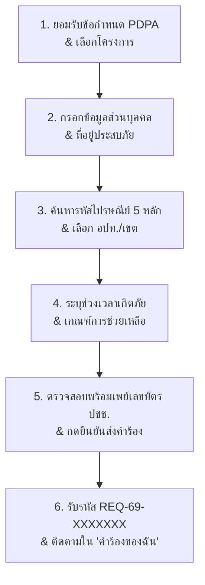

# 📱 คู่มือการใช้งานระบบ Mini-App "ลงทะเบียนเยียวยาผู้ประสบอุทกภัย 69" บนแอปทางรัฐ
> **สำหรับ:** ประชาชนและเจ้าหน้าที่ผู้ใช้งานระบบบริการดิจิทัล "เงินช่วยเหลือผู้ประสบอุทกภัย ปี 2569"  
> **โครงการ:** เงินช่วยเหลือผู้ประสบอุทกภัยในช่วงฤดูฝน ปี 2569 ตามมติคณะรัฐมนตรี (กรมป้องกันและบรรเทาสาธารณภัย - ปภ.)  
> **อัปเดตล่าสุด:** 8 ตุลาคม 2569 (เพิ่มข้อควรระวังสำคัญห้ามปฏิเสธคำร้องซ้ำซ้อนให้ใช้แทนที่รายการ, ขั้นตอนแก้ไขคำร้องเมื่อ อปท. ส่งคืนเพื่อแก้ไข อปท., ระบบตรวจสอบสถานะ Walk-in ออนไลน์, กำหนดปิดรับคำร้อง 25 ธ.ค. 69, และรอบโอนเงินออมสิน 3 วันทำการ)

---

> [!IMPORTANT]
> ### 📌 ขอบเขตของระบบบริการลงทะเบียนเยียวยาอุทกภัยบนแอป "ทางรัฐ"
> - 📱 **ระบบนี้ใช้สำหรับ:** **ยื่นขอรับเงินช่วยเหลือเยียวยาผู้ประสบอุทกภัยตามมติ ครม. (ปภ.) สูงสุดไม่เกิน 9,000 บาท** ต่อครัวเรือน (ยื่นได้ทั่วประเทศ ทั้งใน กทม. และ ต่างจังหวัด)
> - 🏙️ **สำหรับประชาชนในพื้นที่กรุงเทพมหานคร:**
>   - เงินช่วยเหลือ ปภ. (มติ ครม. สูงสุด 9,000 บาท) ➔ ยื่นผ่านระบบ **"ลงทะเบียนเยียวยาอุทกภัย บนแอปทางรัฐ"**
>   - เงินชดเชยค่าซ่อมบ้านและค่าเสียหายจริงของ กทม. (สูงสุด 88,600 บาท) ➔ ยื่นผ่านเว็บไซต์ **[Claim Bangkok (https://claim.bangkok.go.th/)](https://claim.bangkok.go.th/)**  
>   *(ประชาชนใน กทม. สามารถยื่นทั้งสองระบบควบคู่กันได้เพื่อรับสิทธิ์ทั้ง 2 ส่วน)*

---

## 📌 สารบัญหัวข้อด่วน (Quick Navigation)
1. [การเข้าสู่บริการและข้อกำหนดบัญชีรับเงิน](#1-การเข้าสู่บริการและข้อกำหนดบัญชีรับเงิน)
2. [ขั้นตอนการกรอกข้อมูลและยื่นคำขอใน Mini-App (Step-by-Step)](#2-ขั้นตอนการกรอกข้อมูลและยื่นคำขอใน-mini-app-step-by-step)
3. [เอกสารและภาพถ่ายประกอบการลงทะเบียน](#3-เอกสารและภาพถ่ายประกอบการลงทะเบียน)
4. [ความหมายของสถานะคำร้องและการติดตามผล](#4-ความหมายของสถานะคำร้องและการติดตามผล)
5. [รวมปัญหาทางเทคนิคที่พบบ่อยและวิธีแก้ไข (Troubleshooting & FAQs)](#5-รวมปัญหาทางเทคนิคที่พบบ่อยและวิธีแก้ไข-troubleshooting--faqs)
6. [ช่องทางการติดต่อสอบถามทางเทคนิค (Support Contacts)](#6-ช่องทางการติดต่อสอบถามทางเทคนิค-support-contacts)

---

## 1. การเข้าสู่บริการและข้อกำหนดบัญชีรับเงิน

### Q1: บริการลงทะเบียนเยียวยาผู้ประสบอุทกภัย อยู่ตรงไหนในแอปทางรัฐ?
**คำตอบ:** 
- เมื่อเปิดแอปพลิเคชันทางรัฐ จะพบแบนเนอร์เด่นที่หน้าแรก หรือเข้าไปที่ **หมวดบริการประชาชน ➔ เลือก "เงินช่วยเหลือผู้ประสบอุทกภัยในช่วงฤดูฝน ปี 2569"**
- กดเข้าสู่บริการเพื่อเริ่มต้นทำรายการยื่นคำขอ

### Q2: ข้อกำหนดบัญชีธนาคารสำหรับรับเงินโอนเยียวยา ต้องเป็นแบบใด?
**คำตอบ:**
- ต้องเป็นบัญชีธนาคารที่ **ผูกพร้อมเพย์ (PromptPay) ด้วยเลขประจำตัวประชาชน 13 หลักของผู้ยื่นคำขอเท่านั้น**
- ไม่สามารถใช้พร้อมเพย์ที่ผูกด้วยหมายเลขโทรศัพท์มือถือได้
- บัญชีต้องมีสถานะปกติ (ไม่ถูกอายัด, ไม่ปิดบัญชี, และชื่อ-นามสกุลต้องตรงกับผู้ยื่นคำขอ)

---

## 2. ขั้นตอนการกรอกข้อมูลและยื่นคำขอใน Mini-App (Step-by-Step)

> [!TIP]
> ### 📖 แนะนำให้อ่าน: คู่มือขั้นตอนการใช้งานอย่างเป็นทางการ (Official Manual)
> **จัดทำโดย:** สำนักงานพัฒนารัฐบาลดิจิทัล (องค์การมหาชน) (สพร. / DGA) ร่วมกับ กรมป้องกันและบรรเทาสาธารณภัย (ปภ.)  
> **เอกสาร:** *"คู่มือขั้นตอนการใช้งาน ยื่นขอรับเงินเยียวยาผู้ประสบภัยตามมติ ครม. บนแอปพลิเคชันทางรัฐ สำหรับลงทะเบียนเยียวยาน้ำท่วม ปี 2569"*  
> เอกสารฉบับนี้มีภาพประกอบหน้าจอจริงครบทุกขั้นตอน (9 หน้าสไลด์) แนะนำให้ประชาชนเปิดดูภาพประกอบจริงควบคู่กับการทำรายการ

### Q3: ขั้นตอนการกรอกข้อมูลในระบบลงทะเบียน มีลำดับอย่างไรตามคู่มือทางการ?
**คำตอบ:** กระบวนการยื่นคำขอมีลำดับขั้นตอนตามคู่มือทางการของ DGA & ปภ. ดังนี้:

#### 📌 สรุปขั้นตอนหลักตามสไลด์คู่มือทางการ (1 / 9 ถึง 9 / 9):
1. **ข้อกำหนดและความเป็นส่วนตัว (PDPA) & เลือกโครงการ (หน้า 1/9):**
   - ทำเครื่องหมายถูกให้ครบทั้ง 2 ช่อง แล้วกด **“ยอมรับ”**
   - เลือกแท็บ **“เปิดรับลงทะเบียน”** ➔ ตรวจสอบชื่อโครงการ ➔ กด **“ลงทะเบียนขอรับความช่วยเหลือ”**
2. **ข้อมูลส่วนบุคคลและคำนำหน้าชื่อ (หน้า 2/9):**
   - เลือก **คำนำหน้าชื่อ** ให้ตรงกับบัตรประชาชน, ตรวจสอบเลขประจำตัวประชาชน ชื่อ-นามสกุล วันเกิด และกรอกเบอร์โทรศัพท์ที่ติดต่อได้
3. **ที่อยู่ที่ได้รับผลกระทบจากภัยพิบัติ (หน้า 2/9 – 4/9):**
   - เลือกระหว่าง **“ใช้ที่อยู่ตามทะเบียนบ้าน”** หรือ **“ใช้ที่อยู่ปัจจุบัน”** ตามข้อเท็จจริง
   - **กรณีใช้ที่อยู่ปัจจุบัน:** เลือกประเภทที่อยู่อาศัย (`บ้านที่มีทะเบียนบ้าน`, `บ้านเช่า`, `บ้านไม่มีเลขที่`)
   - กรอกเลขที่บ้าน, ชั้น (ถ้ามี), ชื่อหมู่บ้าน/คอนโด (ถ้ามี)
   - ⚠️ **ช่อง "หมู่ที่ *":** หากไม่มีข้อมูลหมู่ที่ (เช่น ใน กทม. หรือเขตเทศบาลเมือง) **ให้พิมพ์เครื่องหมายขีด `-`**
4. **การค้นหารหัสไปรษณีย์ 5 หลัก และเลือกพื้นที่ (หน้า 5/9 – 6/9):**
   - **แตะช่อง “รหัสไปรษณีย์” หรือไอคอนแว่นขยาย:** กรอกรหัสไปรษณีย์ 5 หลัก เพื่อให้ระบบดึงข้อมูลตำบล/แขวง อำเภอ/เขต และจังหวัดขึ้นมาให้เลือก
   - **กรณีต่างจังหวัด (อปท.):** ต้องแตะเลือก **“อปท./อบต.”** ที่ดูแลพื้นที่ที่บ้านประสบภัยตั้งอยู่จริงให้ถูกต้อง
   - **กรณี กทม.:** ตรวจสอบ แขวง เขต และจังหวัด ที่ระบบดึงข้อมูลให้
5. **วันที่ได้รับผลกระทบ, กรณีการช่วยเหลือ และ PromptPay (หน้า 7/9):**
   - แตะเลือก **วันที่เริ่มต้น** และ **วันที่สิ้นสุด** ที่ได้รับผลกระทบ (ระบบจะคำนวณระยะเวลาให้)
   - เลือก **กรณีการช่วยเหลือ** ให้ตรงกับสภาพความเป็นจริง (รายการที่เป็นสีเทา ระบบไม่เปิดให้เลือกเนื่องจากไม่เข้าเงื่อนไขตามวันที่)
   - ตรวจสอบการผูกบัญชี **PromptPay** (ต้องผูกด้วยเลขประจำตัวประชาชน 13 หลักเท่านั้น)
6. **ตรวจสอบและส่งใบคำร้อง (หน้า 8/9):**
   - ตรวจทานข้อมูลทั้งหมดอีกครั้ง แล้วกด **“ยืนยันข้อมูล”**
   - เมื่อระบบแสดงข้อความ **“ส่งใบแบบคำร้องสำเร็จ”** ให้อ่านและ **จดจำรหัสการลงทะเบียน (`REQ-69-XXXXXXX`)** หรือแคปหน้าจอเก็บไว้
7. **การติดตามคำร้องและสถานะการพิจารณา (หน้า 9/9):**
   - จากหน้าหลักของบริการ กดเลือก **“คำร้องของฉัน”** หรือ **“ดูรายละเอียดคำร้องของฉัน”**
   - ระบบจะแสดงสถานะ 3 ขั้นตอน: `ยื่นคำขอ` ➔ `อยู่ในระหว่างการพิจารณา` ➔ `ผลการพิจารณา`

---

### ⚠️ 5 จุดสำคัญที่ต้องระวังเป็นพิเศษ (Key Gotchas):
1. **ต้องค้นหาด้วยรหัสไปรษณีย์ 5 หลักก่อนเสมอ:** เพื่อให้ระบบค้นหาและดึงฐานข้อมูลตำบล อำเภอ จังหวัด ได้อย่างแม่นยำ
2. **ห้ามเลือก อปท. หรือ สำนักงานเขต ผิดเด็ดขาด:** ต้องเลือกหน่วยงานที่รับผิดชอบจุดที่บ้านตั้งอยู่จริง ไม่ใช่ที่อยู่ตามบัตร ปชช. มิฉะนั้นระบบจะแจ้งเตือนว่า "ไม่อยู่ในพื้นที่" หรือคำร้องไปตกผิดหน่วยงาน
3. **ช่อง "หมู่ที่ *" หากไม่มีให้ใส่ `-`:** อย่าเว้นว่างไว้เพราะเป็นช่องบังคับ (Required Field)
4. **พร้อมเพย์ต้องเป็นเลขบัตรประชาชน 13 หลัก:** ไม่สามารถใช้พร้อมเพย์เบอร์มือถือได้เด็ดขาด
5. **การรับแจ้งเตือนขอเอกสารเพิ่ม (เลนเหลือง):** ในกรณีที่เป็นบ้านเช่า หรือไม่เคยได้รับเงินเยียวยา ปภ. มาก่อน เจ้าหน้าที่เขตอาจส่ง Push Notification รายบุคคลเข้าแอปทางรัฐ พร้อมแนบลิงก์เว็บ กทม. ให้กดเข้าไปอัปโหลดสัญญาเช่าส่งให้เขตตรวจได้

---

## 3. เอกสารและภาพถ่ายประกอบการลงทะเบียน

### Q4: ในการยื่นผ่าน Mini-App ต้องแนบภาพถ่ายความเสียหายหรืออัปโหลดไฟล์เอกสารหรือไม่?
**คำตอบ:**
- **ไม่ต้องแนบภาพถ่ายความเสียหาย:** ระบบลงทะเบียนบนแอปทางรัฐในปัจจุบัน **ไม่ได้บังคับให้แนบภาพถ่ายความเสียหาย** และยังไม่มีช่องให้อัปโหลดไฟล์รูปภาพ ประชาชนสามารถกรอกข้อมูลตามความเป็นจริงและกดยื่นคำขอได้ทันที
- **การตรวจสอบข้อมูล:** ระบบจะตรวจสอบข้อมูลตัวบุคคลและสถานะทางทะเบียนราษฎรผ่านฐานข้อมูลภาครัฐโดยอัตโนมัติ
- **กรณีบ้านเช่า และบ้านไม่มีเลขที่:** ในหน้าจอแบบคำร้องระบบมีตัวเลือกให้เลือกระหว่าง "บ้านที่มีทะเบียนบ้าน", "บ้านเช่า", หรือ "บ้านไม่มีเลขที่" (หากเลือกบ้านไม่มีเลขที่ จะมีให้เลือกระบุต่อว่าเป็น "บ้านของตนเอง" หรือ "บ้านเช่า") ทั้งนี้ อปท. หรือ สำนักงานเขต อาจขอตรวจสอบสัญญาเช่าหรือหนังสือรับรองการอยู่อาศัยในขั้นตอนลงพื้นที่หรือประสานงานเพิ่มเติมในภายหลัง

---

## 4. ความหมายของสถานะคำร้องและการติดตามผล

### Q5: สถานะคำร้องแต่ละขั้นตอน มีความหมายอย่างไร?
**คำตอบ:** 
*(หมายเหตุ: การใช้สัญลักษณ์สีด้านล่างนี้ เป็นการจัดกลุ่มสถานะเพื่อความเข้าใจง่ายตามลำดับทางเดินเอกสาร บนหน้าจอจริงของแอปทางรัฐอาจไม่ได้แสดงผลเป็นตัวหนังสือสีตามนี้)*

| กลุ่มสถานะ | ความหมาย | สิ่งที่ประชาชนต้องทำ |
| :--- | :--- | :--- |
| 🟡 **รอตรวจสอบข้อมูล** | คำร้องถูกส่งเข้าสู่ระบบหลังบ้านของ อปท. หรือ สำนักงานเขต เรียบร้อยแล้ว กำลังรอเจ้าหน้าที่ตรวจสอบความถูกต้อง | รอเจ้าหน้าที่ดำเนินการ ไม่ต้องกดยื่นคำขอซ้ำ |
| 🟣 **ส่งคืนเพื่อแก้ไข** | เจ้าหน้าที่ตรวจสอบพบข้อผิดพลาด เช่น **เลือก อปท./สำนักงานเขต ผิดพื้นที่** หรือข้อมูลไม่ครบถ้วน | **กดเข้าไปในระบบเพื่อแก้ไขข้อมูล** เช่น กดเลือก อปท./เขต ให้ถูกต้อง แล้วกดยืนยันส่งใหม่ |
| 🟢 **ผ่านการตรวจสอบ / อยู่ระหว่างเสนอคณะกรรมการ** | คำร้องผ่านการคัดกรองเบื้องต้นจาก อปท./เขต และถูกรวบรวมเข้าสู่ที่ประชุมคณะกรรมการ ท.1 เรียบร้อยแล้ว | รอการส่งต่อให้อำเภอ/กทม. และ ปภ. สั่งจ่ายเงิน |
| 🔵 **ส่งข้อมูลให้ธนาคารโอนเงิน** | ปภ. อนุมัติการจ่ายเงินและส่งไฟล์ข้อมูลให้ธนาคารออมสินเพื่อโอนเข้าบัญชีพร้อมเพย์ | รอรับเงินโอนเข้าบัญชีพร้อมเพย์เลขบัตร ปชช. |
| 🔴 **ไม่อนุมัติ / มีผู้ลงทะเบียนแล้ว** | ตรวจพบว่าบ้านเลขที่ดังกล่าวมีการยื่นคำขอซ้ำซ้อน หรือไม่อยู่ในพื้นที่ประกาศเขตภัยพิบัติ | ตรวจสอบกับสมาชิกในบ้าน หรือติดต่อ อปท./เขต เพื่อยื่นอุทธรณ์ |

### Q6: ทำไมกดส่งแก้ไขข้อมูลไปแล้ว แต่สถานะยังขึ้นว่า "รอผู้ยื่นแก้ไขข้อมูล" อยู่?
**คำตอบ:**
- เนื่องจากมีผู้ลงทะเบียนใช้งานพร้อมกันจำนวนมากทั่วประเทศ การรับส่งข้อมูลระหว่างระบบแอปพลิเคชันและระบบหลังบ้านของเจ้าหน้าที่ อปท. จะทำการ **ประมวลผลเป็นรอบ (Batch Processing)**
- เมื่อผู้ยื่นกดส่งข้อมูลแก้ไขแล้ว ข้อมูลอาจใช้เวลาเดินทางเข้าสู่ระบบหลังบ้านประมาณ 1-2 ชั่วโมง ขอให้รอการประมวลผลตามลำดับคิวโดยไม่ต้องกดส่งย้ำซ้ำๆ

### Q7: กรอบเวลาการตรวจรับรองและโอนเงินเยียวยาของ ปภ. ใช้เวลากี่วัน และเงินจะเริ่มโอนเมื่อใด?
**คำตอบ:** 
- **การเร่งรัดข้อมูล:** ทาง ปภ. ได้ประสานไปยัง **65 จังหวัดและ กทม.** ให้เร่งสำรวจและส่งข้อมูลกลับมายังส่วนกลาง
- **ขั้นตอนการตรวจสอบของ ปภ.:** เมื่อ ปภ. ได้รับข้อมูลและตรวจสอบความถูกต้องแล้ว (ใช้เวลาประมาณ **2 วัน**)
- **ขั้นตอนการโอนเงินของธนาคาร:** ปภ. จะส่งต่อให้ **ธนาคารออมสิน** เพื่อโอนเงินเข้าบัญชีประชาชน **ภายใน 3 วันทำการ**
- **เป้าหมายการจ่ายเงิน:** รัฐบาลและ ปภ. ตั้งเป้าหมายให้เริ่มโอนเงินได้ **ภายในสัปดาห์นี้** (สัปดาห์วันที่ 5 ตุลาคม 2569)

---

## 5. รวมปัญหาทางเทคนิคที่พบบ่อยและวิธีแก้ไข (Troubleshooting & FAQs)

### Q8: เลือก อปท. หรือ สำนักงานเขตผิด ทำให้คำร้องไปตกที่อื่น ประชาชนจะกดยกเลิกหรือย้ายเองได้ไหม?
**คำตอบ:**
- **ประชาชนไม่สามารถกดย้ายหรือยกเลิกคำร้องด้วยตนเองได้ในขณะที่สถานะขึ้น "รอตรวจสอบ"**
- **ขั้นตอนการแก้ไขที่ถูกต้อง:**
  1. เจ้าหน้าที่ของ อปท./เขต ที่ได้รับคำร้องผิดไป จะทำการกดปุ่ม **"ส่งคืนคำร้องเพื่อแก้ไข อปท."** ในระบบหลังบ้าน (เจ้าหน้าที่จะไม่กด "ปฏิเสธ" เพราะจะทำให้สิทธิ์ของประชาชนถูกล็อกถาวร)
  2. เมื่อส่งคืนแล้ว คำร้องในแอปทางรัฐจะเปลี่ยนเป็นสถานะ **"ส่งคืนเพื่อแก้ไข"**
  3. ให้ผู้ยื่นเปิดแอปทางรัฐ เข้าไปที่เมนู **"คำร้องของฉัน"** ➔ แตะเลือกคำร้องเดิม ➔ **กดเลือกจังหวัด อำเภอ และ อปท./สำนักงานเขต ที่ถูกต้องตรงกับบ้านที่ประสบภัย** ➔ กดยืนยันส่งใหม่อีกครั้ง
  4. คำร้องจะวิ่งไปยังกล่องงานของ อปท./สำนักงานเขต ที่ถูกต้องทันทีโดยไม่ต้องลงทะเบียนใหม่ตั้งแต่ต้น

### Q9: ระบบแจ้งเตือนว่า “ไม่อยู่ในพื้นที่” / “อยู่นอกพื้นที่ประสบภัย” หรือ “ไม่อยู่ในเขตให้การช่วยเหลือ” เกิดจากอะไรและมีวิธีแก้ไขอย่างไร?
**คำตอบ:** ปัญหานี้มักพบเมื่อประชาชนกรอกข้อมูลไม่ตรงกับพื้นที่ประกาศภัยหรือฐานข้อมูลระบบ โดยมีวิธีแก้ไขดังนี้:
1. **ตรวจสอบการเลือกพื้นที่ (อปท. หรือ สำนักงานเขต) ให้ถูกต้องตรงกับความเป็นจริง:**
   - ให้ตรวจสอบการเลือกพื้นที่ (องค์กรปกครองส่วนท้องถิ่น หรือสำนักงานเขต) ให้ถูกต้องตรงกับความเป็นจริง เช่น อยู่ **เขตประเวศ ให้เลือกและยืนยันเขตประเวศให้ถูกต้อง** มิฉะนั้นระบบจะไม่สามารถกดยื่นคำร้องได้
   - สามารถตรวจสอบรายชื่อตำบล/อปท. ที่ประกาศเป็นเขตให้ความช่วยเหลือฯ ได้จาก 👉 [ระบบตรวจสอบพื้นที่ประกาศเขตภัยพิบัติ ปภ. (relief.disaster.go.th)](https://relief.disaster.go.th/01a0477d-1fdf-778c-bd26-4aeac3e736cb)
2. **หากส่งไปแล้วต้องการแก้ไขข้อมูล:**
   - สามารถเข้าไปตรวจสอบและแก้ไขได้ที่เมนู **“คำร้องของฉัน”** ภายในแอปทางรัฐ
3. **ตรวจสอบการระบุ “วันที่เกิดภัย”:**
   - ตรวจสอบการระบุ **“วันที่เกิดภัย” ให้ตรงตามสถานการณ์จริง** และสอดคล้องกับเงื่อนไขการรับเงินช่วยเหลือ (เช่น ระยะเวลาน้ำท่วมขัง 7 วันขึ้นไป)
4. **กรณีประกาศภัยพิบัติใหม่ (ระบบอยู่ระหว่างการซิงก์รหัสพื้นที่):**
   - กรณีที่ประกาศภัยพิบัติเพิ่งได้รับการอนุมัติ ปภ. จะส่งรหัสพื้นที่เข้าสู่ฐานข้อมูลระบบลงทะเบียนเป็นรอบๆ หากเพิ่งประกาศวันแรก ขอให้เว้นระยะ 12-24 ชั่วโมงแล้วลองเข้าทำรายการใหม่อีกครั้ง หรือติดต่อ อปท. ในพื้นที่เพื่อตรวจสอบว่าระบบเปิดรับพื้นที่ดังกล่าวแล้วหรือยัง

### Q10: ระบบฟ้องว่า "เลขบัตรประชาชนนี้ใช้ไปแล้ว" หรือ "มีผู้ลงทะเบียนแล้วในบ้านหลังนี้" ทำอย่างไร?
**คำตอบ:**
- **เกณฑ์กฎหมาย:** เงินช่วยเหลือผู้ประสบภัย 1 หลังคาเรือน (1 เลขรหัสประจำบ้าน) ได้รับสิทธิ์เพียง **1 สิทธิ์เท่านั้น**
- **วิธีตรวจสอบและแก้ไขที่ถูกต้อง:**
  - ตรวจสอบกับสมาชิกในทะเบียนบ้านว่า มีบุคคลในครอบครัวหรือผู้เช่าคนอื่นยื่นคำขอไปก่อนแล้วหรือไม่ โดยในหน้ารายละเอียดของระบบจะแสดงข้อมูลเบื้องต้นว่าคำร้องถูกยื่นซ้ำกับผู้ใด
  - **หากต้องการเปลี่ยนให้เจ้าบ้านหรือผู้มีสิทธิ์ตัวจริงเป็นผู้รับเงิน:**
    1. ให้คนในครอบครัวตกลงกันว่าใครจะเป็นตัวแทนรับเงิน (แนะนำให้เป็นเจ้าบ้าน)
    2. ให้ผู้มีสิทธิ์ตัวจริงยื่นคำร้องเข้ามาในระบบตามปกติ
    3. ติดต่อ อปท. หรือ สำนักงานเขตของ กทม. ในพื้นที่ โดยแจ้งเจ้าหน้าที่ว่าขอเปลี่ยนตัวผู้รับสิทธิ์
    4. เจ้าหน้าที่จะเปิดคำร้องของผู้มีสิทธิ์ตัวจริง แล้วกดปุ่ม **"แทนที่รายการ" (Replace)** เพื่อแทนที่รายการเดิมที่ยื่นผิดอย่างสมบูรณ์
    > ⛔ **คำเตือนเด็ดขาด:** ห้ามขอให้เจ้าหน้าที่กด **"ปฏิเสธ" (Reject)** รายการเดิมเป็นอันขาด! เพราะการกดปฏิเสธจะทำให้เลขบัตรประชาชนและรหัสประจำบ้านนั้นถูกล็อกในระบบถาวร ไม่สามารถยื่นใหม่หรือแก้ไขสิทธิ์ได้อีก
  - หากเป็นกรณีบ้านเลขที่เดียวกันแต่อาศัยอยู่คนละครอบครัวอย่างชัดเจน (เช่น บ้านแบ่งเช่าหลายห้อง) ให้เดินทางไปติดต่อสำนักงานเขต หรือ อปท. เพื่อให้เจ้าหน้าที่จัดทำเอกสารรับรองข้อเท็จจริงรายบุคคล

### Q11: ยื่นคำขอผ่านระบบสำเร็จแล้ว จำเป็นต้องเดินทางไปยื่นเอกสารที่ อปท. หรือ สำนักงานเขต อีกหรือไม่?
**คำตอบ:**
- **ไม่ต้องเดินทางไปยื่นซ้ำ:** ข้อมูลที่ส่งผ่านระบบจะเข้าสู่หน้าจอตรวจสอบของเจ้าหน้าที่ในพื้นที่โดยตรง
- **ข้อยกเว้น:** ไปติดต่อเฉพาะเมื่อได้รับการประสานจาก อปท./เขต ขอเอกสารยืนยันเพิ่มเติมเท่านั้น (เช่น สัญญาเช่าบ้าน หรือเอกสารยืนยันกรณีบ้านไม่มีเลขที่)
- **ข้อควรระวัง:** การเดินทางไป Walk-in ซ้ำอีกรอบโดยไม่ได้แจ้งเจ้าหน้าที่ อาจทำให้เกิดรายการซ้ำซ้อนในระบบ และทำให้กระบวนการตรวจสอบล่าช้าลง

### Q12: ยื่นคำขอแล้ว แต่ต่อมาโทรศัพท์เสีย หรือเข้าแอปไม่ได้ จะแก้ไขข้อมูลอย่างไร?
**คำตอบ:**
- ข้อมูลการลงทะเบียนผูกติดกับ **เลขประจำตัวประชาชนและบัญชีผู้ใช้งาน** ไม่ได้ผูกติดกับตัวเครื่องโทรศัพท์
- สามารถนำโทรศัพท์เครื่องอื่น (ของคนในครอบครัว) เข้าสู่ระบบด้วยบัญชีเดิมเพื่อเข้าไปดูสถานะหรือแก้ไขคำร้องได้
- หากไม่สะดวกใช้โทรศัพท์เครื่องอื่น สามารถนำบัตรประชาชนเดินทางไปติดต่อสำนักงานเขตของ กทม. หรือ อปท. ในพื้นที่ เพื่อให้เจ้าหน้าที่ตรวจสอบสถานะคำร้องในระบบหลังบ้านให้

### Q13: กรณีผู้สูงอายุ ไม่มีสมาร์ตโฟน หรือใช้ระบบไม่เป็น มีแนวทางดำเนินการอย่างไร?
**คำตอบ:** ดำเนินการได้ 2 แนวทาง:
1. **ให้บุตรหลานช่วยลงทะเบียนผ่านระบบ:** โดยเข้าสู่ระบบและกรอกข้อมูลในนามของผู้สูงอายุ (เจ้าบ้าน/ผู้ประสบภัย)
2. **เดินทางไป Walk-in:** ไปที่จุดบริการ One-Stop Service ณ สำนักงานเขต (กทม. ทั้ง 50 เขต) หรือ ที่ว่าการอำเภอ / เทศบาล / อบต. โดยนำบัตรประชาชนและสมุดบัญชีธนาคารพร้อมเพย์ไปด้วย เจ้าหน้าที่มีทีมงานคอยบันทึกข้อมูลเข้าระบบให้โดยตรง

### Q14: ยื่นคำขอผ่านแอปทางรัฐไปแล้ว แต่เปลี่ยนใจไปยื่น Walk-in ที่ อปท./สำนักงานเขต จะมีปัญหาข้อมูลตีกันหรือไม่?
**คำตอบ:**
- **ไม่มีปัญหาครับ:** เมื่อประชาชนนำเอกสารหลักฐานไปยื่น Walk-in และเจ้าหน้าที่ อปท./สำนักงานเขต ตรวจสอบความถูกต้องพร้อมบันทึกเข้าระบบ Walk-in สำเร็จแล้ว ระบบจะยึดข้อมูลการ Walk-in เข้าสู่ที่ประชุม ท.1
- **สิ่งที่ต้องทำในแอปทางรัฐ:** ประชาชน **ไม่ต้องเข้าไปกดยื่นซ้ำหรือแก้ไขข้อมูลในแอปทางรัฐอีก** แม้สถานะเดิมในแอปจะขึ้นว่าส่งคืนเพื่อแก้ไข ข้อมูลในแอปจะไม่ไปรบกวนสิทธิ์ที่เจ้าหน้าที่ได้อนุมัติผ่านระบบ Walk-in เรียบร้อยแล้ว

---

## 6. ช่องทางการติดต่อสอบถามทางเทคนิค (Support Contacts)

- 🚨 **สายด่วนนิรภัย กรมป้องกันและบรรเทาสาธารณภัย (ปภ.):** โทร. **1784** (ตลอด 24 ชั่วโมง)  
  *สอบถามหลักเกณฑ์สิทธิ์เงินช่วยเหลือตามมติ ครม. การตรวจสอบสถานะคำร้อง และการโอนเงิน*
- 📱 **DGA Contact Center (ผู้พัฒนาระบบลงทะเบียน):** โทร. **02-612-6060** (วันและเวลาราชการ)  
  *สอบถามปัญหาทางเทคนิคและข้อขัดข้องในการใช้งานระบบ*
- 🏛️ **ศูนย์บริการข้อมูลกรุงเทพมหานคร (กทม.):** โทร. **1555** (ตลอด 24 ชั่วโมง)  
  *สอบถามจุดบริการ Walk-in สำนักงานเขตของ กทม. (50 เขต) และระบบ [Claim Bangkok (https://claim.bangkok.go.th/)](https://claim.bangkok.go.th/)*
- 🌐 **ระบบตรวจสอบพื้นที่ประกาศเขตภัยพิบัติ ปภ.:** [https://relief.disaster.go.th/01a0477d-1fdf-778c-bd26-4aeac3e736cb](https://relief.disaster.go.th/01a0477d-1fdf-778c-bd26-4aeac3e736cb)  
  *สำหรับตรวจสอบรายชื่อจังหวัด อำเภอ ตำบล/อปท. ที่ประกาศเป็นเขตให้ความช่วยเหลือฯ ตามกฎหมาย*
- 🌐 **ระบบตรวจสอบสถานะคำร้อง ปภ. (Track Relief):** [https://relief.disaster.go.th/01a0477d-1fdf-778c-bd26-4aeac3e736cb/track](https://relief.disaster.go.th/01a0477d-1fdf-778c-bd26-4aeac3e736cb/track)  
  *สำหรับประชาชนตรวจสอบสถานะคำร้อง (ทั้งยื่นออนไลน์และ Walk-in) ด้วยเลขบัตรประชาชน 13 หลัก*

> ⚠️ **กำหนดเวลาสิ้นสุดโครงการ:** สำหรับภัยที่เกิดขึ้นก่อนหรือภายในวันที่ 30 กันยายน 2569 ปภ. กำหนดปิดระบบรับคำร้องลงทะเบียนในวันที่ **25 ธันวาคม 2569 เวลา 12:00 น. (เที่ยงวัน)** (โครงการสิ้นสุดวันที่ 29 ธันวาคม 2569)

---

*รวบรวมและปรับปรุงข้อมูลโดย Open Semantic Knowledge (OSK System) เพื่อเป็นคู่มือทางเทคนิคสำหรับประชาชนและเจ้าหน้าที่ผู้ปฏิบัติงาน*
