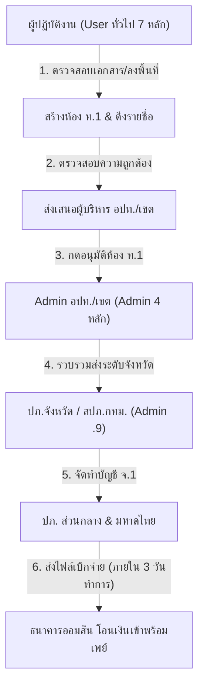

# 📝 รายงานข้อหารือและประเด็นหน้างานรายวัน (Daily Digest)
> **ประจำวันที่:** 8 ตุลาคม 2569  
> **แหล่งข้อมูล:** กลุ่มงานสนับสนุนระบบสารสนเทศ ปภ., การซักซ้อมและถาม-ตอบข้อหารือผู้ปฏิบัติงาน กทม. 50 เขต, เครือข่าย อปท. ทั่วประเทศ (สถ./ปภ.), ระบบบริหารจัดการเงินช่วยเหลือผู้ประสบอุทกภัย (`relief.disaster.go.th`), และประกาศกรอบเวลาเร่งรัดโครงการ  
> **ระบบประมวลผล:** OSK Automated Knowledge Distillation

---

### 1. สรุปประเด็นสำคัญและนโยบายเร่งด่วน (Key Highlights & Timelines)

#### ก. เส้นตายการยื่นคำร้องและการปิดระบบรับคำขอ (Deadline 25 ธ.ค. 69)
1. **กำหนดปิดรับคำร้อง 25 ธันวาคม 2569 เวลา 12:00 น. (เที่ยงวัน):**
   - กรมป้องกันและบรรเทาสาธารณภัย (ปภ.) แจ้งกำหนดปิดระบบรับคำร้องลงทะเบียน (ทั้งผ่านแอปทางรัฐ และระบบบันทึก Walk-in) สำหรับเหตุอุทกภัยที่เกิดขึ้นก่อนหรือภายในวันที่ 30 กันยายน 2569
   - โครงการเงินช่วยเหลือเยียวยาผู้ประสบอุทกภัยตามมติ ครม. มีกำหนดสิ้นสุดโครงการในวันที่ **29 ธันวาคม 2569** ทางราชการจึงต้องปิดรับคำร้องล่วงหน้าเพื่อให้ อปท., สำนักงานเขต, อำเภอ และจังหวัด มีเวลาตรวจสอบรับรองรายชื่อ ท.1 / จ.1 และส่งเบิกจ่ายเงินกับธนาคารออมสินได้ทันกำหนดเวลา
2. **รอบการส่งข้อมูลและโอนเงินธนาคารออมสิน (SLA ไม่เกิน 3 วันทำการ):**
   - เมื่อที่ประชุมคณะกรรมการระดับจังหวัด/กทม. อนุมัติบัญชี จ.1 และกระทรวงมหาดไทย/ปภ. ตรวจสอบไฟล์รายชื่อเรียบร้อย จะส่งไฟล์ข้อมูลให้ **ธนาคารออมสิน** ทันที
   - ธนาคารออมสินมีกรอบเวลาประมวลผลและโอนเงินเข้าบัญชีพร้อมเพย์ของผู้มีสิทธิภายใน **ไม่เกิน 3 วันทำการ** (เฉพาะบัญชีที่ผูกพร้อมเพย์ด้วยเลขประจำตัวประชาชน 13 หลักและบัญชีมีความเคลื่อนไหวปกติ)
3. **เปิดระบบติดตามสถานะคำร้องออนไลน์สำหรับประชาชน (Track Relief):**
   - ปภ. เปิดให้ประชาชนสามารถตรวจสอบสถานะคำร้องของตนเองได้ทางเว็บไซต์ 👉 **[ระบบติดตามสถานะคำร้องเงินช่วยเหลือ ปภ.](https://relief.disaster.go.th/01a0477d-1fdf-778c-bd26-4aeac3e736cb/track)** (`https://relief.disaster.go.th/01a0477d-1fdf-778c-bd26-4aeac3e736cb/track`)
   - รองรับทั้งผู้ที่ลงทะเบียนผ่านแอปทางรัฐ และผู้ที่ไปยื่นเอกสารแบบ Walk-in ณ สำนักงานเขต/อปท. โดยใช้เพียงเลขบัตรประจำตัวประชาชน 13 หลัก

---

### 2. กฎเหล็กและข้อพึงระวังขั้นวิกฤตของระบบหลังบ้าน (Critical Backoffice Rules)

> [!CAUTION]
> #### ⛔ กฎเหล็กข้อที่ 1: ห้ามกดปุ่ม "ปฏิเสธ" (Reject) คำร้องที่ยื่นซ้ำในบ้านเดียวกันเด็ดขาด!
> - **ผลกระทบถาวร:** การกดปุ่ม **"ปฏิเสธ"** ในระบบ ปภ. จะส่งผลให้ระบบทำการ **ล็อกเลขประจำตัวประชาชนและรหัสประจำบ้านนั้นเป็นการถาวรทันที** ไม่สามารถย้อนกลับ (Revert/Undo) หรือยื่นซ้ำได้อีกเลย แม้จะเคยกดรับรองไว้แล้วก็ตาม
> - **แนวทางแก้ไขที่ถูกต้อง:** ให้ใช้ฟังก์ชัน **"แทนที่รายการ" (Replace)** เท่านั้น
>   1. ให้บุคคลที่ตกลงกันว่าจะเป็นผู้รับสิทธิ์จริง (เช่น เจ้าบ้าน) ดำเนินการยื่นคำร้องเข้ามาในระบบ
>   2. เจ้าหน้าที่เปิดดูคำร้องของบุคคลที่ถูกต้องในกล่องรอดำเนินการ
>   3. กดปุ่ม **"แทนที่รายการ"** ระบบจะทำการนำคำร้องที่ถูกต้องเข้ามารับสิทธิ์แทนที่รายการเดิม และยกเลิกรายการเดิมให้อย่างปลอดภัยโดยไม่ทำให้สิทธิ์ของบ้านถูกล็อกถาวร

> [!WARNING]
> #### ⚠️ กฎเหล็กข้อที่ 2: กรณีประชาชนเลือก อปท. หรือ สำนักงานเขตผิด ห้ามกด "ปฏิเสธ" เด็ดขาด!
> - หากประชาชนเลือก อปท. หรือสำนักงานเขตไม่ตรงกับพื้นที่ตั้งบ้านจริง ห้ามเจ้าหน้าที่กดปฏิเสธคำร้อง
> - **แนวทางที่ถูกต้อง:** ให้กดปุ่ม **"ส่งคืนคำร้องเพื่อแก้ไข อปท."** เท่านั้น
> - เมื่อกดแล้ว คำร้องจะตีกลับไปยังแอปทางรัฐของประชาชน ประชาชนสามารถเข้าไปที่เมนู "คำร้องของฉัน" เพื่อแก้ไขเลือก อปท./เขต ให้ถูกต้อง และกดยืนยันส่งใหม่ คำร้องจะวิ่งไปยังหน่วยงานที่ถูกต้องทันที

#### ค. สัจธรรมเรื่อง "สีแถบคำร้อง" (Color Lane Permanence)
- **แถบสีจะไม่เปลี่ยนในระบบ:** แถบสีเขียว / เหลือง / แดง เป็นผลลัพธ์จากการตรวจสอบไขว้ข้อมูลอัตโนมัติ (Automated Linkage) ในขั้นตอนแรกรับคำร้องเท่านั้น
- **ข้อเท็จจริงสำคัญ:** เมื่อเจ้าหน้าที่ อปท./เขต ได้รับเอกสารเพิ่มเติม เช่น สัญญาเช่าบ้าน หรือลงพื้นที่ตรวจสอบข้อเท็จจริงแล้ว **สีแถบคำร้องในระบบจะไม่เปลี่ยนจากสีเหลืองเป็นสีเขียว**
- **วิธีปฏิบัติ:** เจ้าหน้าที่ไม่ต้องรอให้ระบบเปลี่ยนสี เมื่อตรวจสอบข้อเท็จจริงและหลักฐานความเสียหายครบถ้วนแล้ว ให้กดปุ่ม **"อนุมัติ"** เพื่อดึงรายชื่อเข้าสู่บัญชี ท.1 ได้ทันที

#### ง. การแก้ไขข้อมูลและการบันทึกในระบบหลังบ้าน
- เมื่อเจ้าหน้าที่เข้าไปแก้ไขข้อมูลผู้ยื่นคำร้องในระบบหลังบ้าน (เช่น แก้ไขชื่อ ที่อยู่ หรือเลขบัญชี) **ต้องเลื่อนลงไปด้านล่างสุดแล้วกดปุ่มสีม่วง "บันทึกแก้ไข" เสมอ**
- หากไม่กดปุ่มสีม่วง ข้อมูลที่พิมพ์แก้ไขจะไม่ถูกบันทึกลงในฐานข้อมูลระบบ

#### จ. สถานะสีดำ "กำลังตรวจสอบข้อมูล" (Linkage in Progress)
- รายการคำร้องที่ขึ้นแท็กสีดำและมีข้อความว่า "กำลังตรวจสอบข้อมูล" ไม่ใช่ระบบค้าง
- เกิดจากการที่ระบบกำลังเชื่อมต่อฐานข้อมูล Linkage ทะเบียนราษฎรของกรมการปกครอง และฐานข้อมูลประวัติการเยียวยาเดิมของ ปภ. เพื่อจัดกลุ่มแถบสี เมื่อเชื่อมโยงเสร็จระบบจะอัปเดตสถานะสีให้โดยอัตโนมัติ

#### ฉ. การปฏิเสธคำร้องไม่มีฟังก์ชัน "ปฏิเสธหลายรายการพร้อมกัน" (No Batch Reject)
- ระบบออกแบบมาโดยเจตนาเพื่อป้องกันความผิดพลาดขั้นรุนแรง จึงไม่มีปุ่มเลือกหลายรายการเพื่อกดปฏิเสธพร้อมกัน (Select All & Reject)
- เจ้าหน้าที่ต้องตรวจสอบและกดทำรายการปฏิเสธทีละรายการเท่านั้น

---

### 3. กระบวนการสร้างห้อง ท.1 และสายการอนุมัติ (ທ.1 Room & Flow)

1. **การสร้างห้องประชุม ท.1:**
   - ผู้ปฏิบัติงานต้องกดสร้างห้องประชุม ท.1 โดยตั้งชื่อห้องให้ชัดเจนตามรูปแบบมาตรฐาน เช่น `ท.1 [ชื่อ อปท./เขต] ครั้งที่ [X]/2569` พร้อมระบุวันที่ประชุม
   - ต้องตรวจสอบให้แน่ใจว่าได้กดเลือกและดึงคำร้องที่ผ่านการตรวจสอบเข้าสู่ห้องประชุม ท.1 ครบถ้วนตามจำนวนที่ต้องการเสนอ
2. **การจำกัดวันที่ตามระบบ:**
   - ระบบมีการตรวจสอบและล็อกวันที่ตามปฏิทินจริงและกรอบเวลาการเกิดภัย ไม่สามารถใส่วันที่ย้อนหลังที่อยู่นอกกรอบเวลาประกาศภัยพิบัติได้
3. **การลงนามและส่งต่อ:**
   - เมื่อ Admin ระดับ อปท./เขต (นายก อปท. หรือ ผอ.เขต) กดอนุมัติห้อง ท.1 แล้ว บัญชีจะถูกส่งต่อไปยัง Admin .9 ของจังหวัด/กทม. เพื่อรวบรวมจัดทำบัญชี จ.1 เสนอ ปภ. ส่วนกลางต่อไป

---

### 4. สรุปประเด็นถาม-ตอบที่พบบ่อยจากห้องแชตผู้ปฏิบัติงาน (Operational Q&A)

| ประเด็นคำถาม | สรุปคำตอบและแนวทางปฏิบัติที่ถูกต้อง |
| :--- | :--- |
| **ลูกบ้านยื่นซ้ำกันหลายคนในบ้านหลังเดียว เจ้าหน้าที่ต้องทำอย่างไร?** | ห้ามกด "ปฏิเสธ" คนใดคนหนึ่งเด็ดขาด ให้บุคคลที่ตกลงกันเป็นผู้รับสิทธิ์ (เจ้าบ้าน) ยื่นคำร้องเข้ามา แล้วเจ้าหน้าที่เข้าไปที่คำร้องนั้นและกด **"แทนที่รายการ"** |
| **ประชาชนเลือก อปท. ผิดพื้นที่ เจ้าหน้าที่เขต/อปท. ต้นทางทำอย่างไร?** | กดปุ่ม **"ส่งคืนคำร้องเพื่อแก้ไข อปท."** เพื่อให้คำร้องตีกลับไปที่แอปทางรัฐของประชาชนสำหรับเลือกพื้นที่ใหม่ |
| **ตรวจเอกสารบ้านเช่าครบแล้ว ทำไมแถบสียังเป็นสีเหลืองอยู่?** | สีแถบจะไม่เปลี่ยนเป็นสีเขียวในระบบ ให้เจ้าหน้าที่กด **"อนุมัติ"** เพื่อส่งชื่อเข้า ท.1 ได้ทันที |
| **ประชาชนยื่น Walk-in ตรวจสอบสถานะคำร้องได้ที่ไหน?** | ตรวจสอบได้ที่เว็บ `https://relief.disaster.go.th/01a0477d-1fdf-778c-bd26-4aeac3e736cb/track` โดยกรอกเลขประจำตัวประชาชน 13 หลัก |
| **เงินจะโอนเข้าบัญชีประชาชนเมื่อใดหลังจังหวัดอนุมัติ?** | เมื่อ ปภ. ส่วนกลางส่งไฟล์ให้ธนาคารออมสิน ธนาคารออมสินจะประมวลผลโอนเงินเข้าพร้อมเพย์ภายใน **ไม่เกิน 3 วันทำการ** |
| **ปิดรับคำร้องวันไหน?** | ปิดระบบรับคำร้องภัยก่อน/ภายใน 30 ก.ย. 69 ในวันที่ **25 ธันวาคม 2569 เวลา 12:00 น.** (โครงการสิ้นสุด 29 ธ.ค. 69) |

---
*จัดทำและสังเคราะห์ข้อมูลโดย Open Semantic Knowledge (OSK Vault) เพื่อสนับสนุนการปฏิบัติงานของศูนย์ปฏิบัติการช่วยเหลือผู้ประสบภัย 2569*
